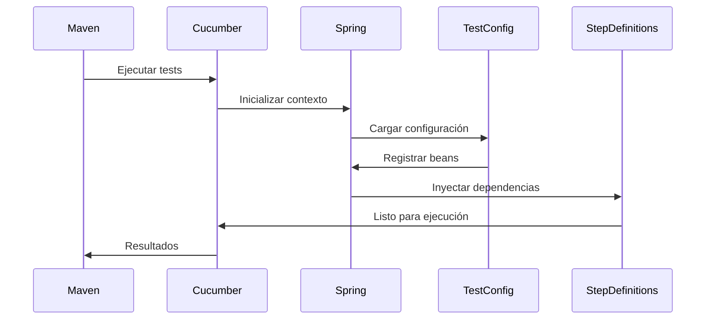

# Cucumber Test Configuration - Documentación Técnica

## 📋 Información General

| **Archivo** | `CucumberTestConfig.java` |
|-------------|---------------------------|
| **Ubicación** | `src/test/java/com/farma_ya/acceptance/` |
| **Propósito** | Configuración de Spring para pruebas de aceptación con Cucumber |
| **Tipo** | Clase de Configuración (Configuration Class) |
| **Framework** | Spring Boot Test + Cucumber BDD |

## 🎯 Propósito y Funcionalidad

### Objetivo Principal
Proporcionar configuración específica de Spring para las pruebas de aceptación ejecutadas con Cucumber BDD, asegurando que los beans y componentes necesarios estén disponibles durante la ejecución de los escenarios.

### Funcionalidad Core
- **Configuración de Contexto**: Establece el contexto de Spring para pruebas Cucumber
- **Profile Management**: Activa únicamente en el perfil `test`
- **Bean Configuration**: Placeholder para beans específicos de testing si se requieren
- **Integration Bridge**: Conecta el framework Cucumber con Spring Boot Test

## 🏗️ Estructura y Componentes

### Anotaciones Utilizadas

#### `@Configuration`
```java
@Configuration
public class CucumberTestConfig {
```
- **Propósito**: Indica que esta clase proporciona configuración de beans de Spring
- **Efecto**: Permite que Spring procese esta clase durante la inicialización del contexto
- **Uso**: Facilita la inyección de dependencias en step definitions de Cucumber

#### `@Profile("test")`
```java
@Profile("test")
public class CucumberTestConfig {
```
- **Propósito**: Activa esta configuración únicamente cuando el perfil `test` está activo
- **Beneficio**: Evita interferencias con configuraciones de producción
- **Compatibilidad**: Se alinea con las configuraciones de otras capas de testing

### Arquitectura de la Clase

```mermaid
graph TB
    A[CucumberTestConfig] --> B[@Configuration]
    A --> C[@Profile("test")]
    A --> D[Spring Context Bridge]
    D --> E[OrderManagementStepDefinitions]
    D --> F[Test Beans]
    D --> G[Repository Mocks]
```

## 🔧 Configuración y Setup

### Perfil de Activación
```properties
# Activación automática en application-test.properties
spring.profiles.active=test
```

### Contexto de Spring
La clase se integra automáticamente con:
- **Spring Boot Test Context**: Para carga completa de la aplicación
- **Cucumber Context**: Para inyección en step definitions
- **Test Profile**: Para configuraciones específicas de testing

## 🎪 Casos de Uso

### 1. **Configuración Básica** (Actual)
```java
@Configuration
@Profile("test") 
public class CucumberTestConfig {
    // Configuración mínima para Cucumber + Spring
}
```

### 2. **Configuración Extendida** (Ejemplo)
```java
@Configuration
@Profile("test")
public class CucumberTestConfig {
    
    @Bean
    @Primary
    public TestDataBuilder testDataBuilder() {
        return new TestDataBuilder();
    }
    
    @Bean
    public MockWebServer mockExternalService() {
        return new MockWebServer();
    }
}
```

### 3. **Configuración con Mocks** (Ejemplo)
```java
@Configuration
@Profile("test")
public class CucumberTestConfig {
    
    @Bean
    @Primary
    public EmailService emailService() {
        return Mockito.mock(EmailService.class);
    }
}
```

## 🔄 Flujo de Ejecución

### Secuencia de Inicialización
1. **Maven/JUnit**: Ejecuta `CucumberTestRunner`
2. **Cucumber Engine**: Descubre feature files y step definitions
3. **Spring Context**: Inicializa con perfil `test`
4. **Config Loading**: Procesa `CucumberTestConfig`
5. **Bean Creation**: Crea beans específicos de testing
6. **Step Definition Injection**: Inyecta dependencias en step definitions
7. **Test Execution**: Ejecuta escenarios Gherkin

### Diagrama de Flujo


## 🌟 Ventajas y Beneficios

### ✅ **Ventajas de Diseño**
- **Simplicidad**: Configuración mínima pero efectiva
- **Flexibilidad**: Fácil extensión para beans adicionales
- **Aislamiento**: Perfil específico evita conflictos
- **Integración**: Seamless con Spring Boot Test

### 🎯 **Beneficios Técnicos**
- **Dependency Injection**: Soporte completo para DI en step definitions
- **Test Isolation**: Configuración separada del código de producción
- **Extensibilidad**: Base para configuraciones más complejas
- **Mantenibilidad**: Punto centralizado para configuración de testing

## 🔌 Integración con Otros Componentes

### Relación con Step Definitions
```java
@CucumberContextConfiguration
@SpringBootTest(classes = FarmaYaApplication.class)
@ActiveProfiles("test")  // ← Activa CucumberTestConfig
public class OrderManagementStepDefinitions {
    
    @Autowired  // ← Inyección habilitada por CucumberTestConfig
    private IOrderService orderService;
}
```

### Relación con Test Runner
```java
@Cucumber  // ← Utiliza configuración de Spring automáticamente
public class CucumberTestRunner {
    // CucumberTestConfig se carga automáticamente
}
```

## 📈 Posibles Extensiones

### Configuración de Test Data
```java
@Bean
public TestDataFactory testDataFactory() {
    return new TestDataFactory();
}
```

### Mock Services
```java
@Bean
@Primary
public NotificationService notificationService() {
    return Mockito.mock(NotificationService.class);
}
```

### Test Utilities
```java
@Bean
public DatabaseCleaner databaseCleaner() {
    return new DatabaseCleaner();
}
```

## 🏷️ Notas Técnicas

### Compatibilidad
- **Spring Boot**: 3.5.0
- **Cucumber**: 7.18.0
- **JUnit**: 5.x (Platform Engine)
- **Java**: 17+

### Consideraciones
- La configuración actual es minimalista pero funcional
- Se puede extender sin modificar el comportamiento existente
- Mantiene compatibilidad con todas las capas de testing
- Perfil `test` se alinea con otras configuraciones del proyecto

---

## 📚 Referencias

- [Spring Boot Testing](https://docs.spring.io/spring-boot/docs/current/reference/html/spring-boot-features.html#boot-features-testing)
- [Cucumber Spring Integration](https://cucumber.io/docs/cucumber/integration/#spring)
- [Spring Profiles](https://docs.spring.io/spring-boot/docs/current/reference/html/spring-boot-features.html#boot-features-profiles)