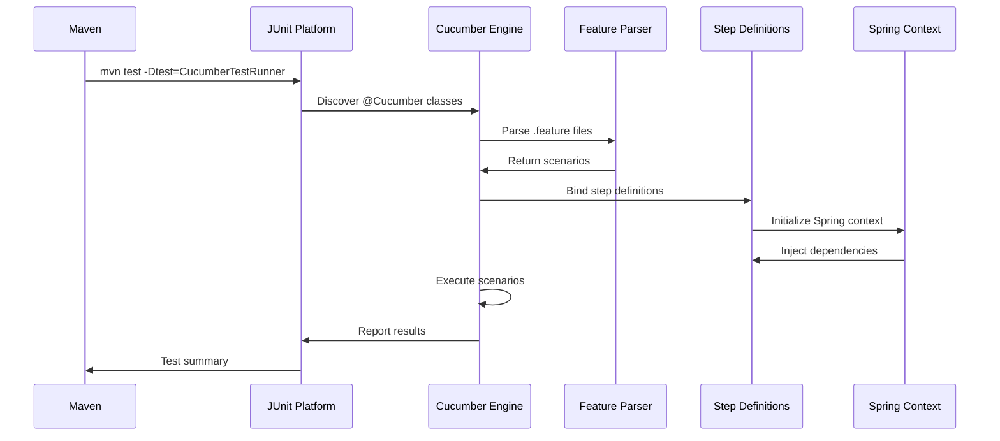

# Cucumber Test Runner - Documentación Técnica

## 📋 Información General

| **Archivo** | `CucumberTestRunner.java` |
|-------------|---------------------------|
| **Ubicación** | `src/test/java/com/farma_ya/acceptance/` |
| **Propósito** | Punto de entrada para la ejecución de pruebas de aceptación con Cucumber |
| **Tipo** | Test Runner Class |
| **Framework** | Cucumber BDD + JUnit 5 Platform Engine |

## 🎯 Propósito y Funcionalidad

### Objetivo Principal
Servir como el punto de entrada principal para la ejecución de todas las pruebas de aceptación escritas en Gherkin, integrando Cucumber BDD con el ecosystem de testing de Maven y JUnit 5.

### Funcionalidad Core
- **Test Discovery**: Descubrimiento automático de feature files (.feature)
- **Step Definition Binding**: Vinculación con step definitions en Java
- **Execution Engine**: Orquesta la ejecución de escenarios BDD
- **Reporting**: Genera reportes de ejecución para análisis

## 🏗️ Estructura y Componentes

### Anotación Principal

#### `@Cucumber`
```java
@Cucumber
public class CucumberTestRunner {
```
- **Propósito**: Marca esta clase como un runner de Cucumber para JUnit 5
- **Efecto**: Habilita el Cucumber Platform Engine
- **Descubrimiento**: Busca automáticamente .feature files y step definitions
- **Integración**: Conecta con el sistema de build (Maven/Gradle)

### Arquitectura del Runner

```mermaid
graph TB
    A[CucumberTestRunner] --> B[@Cucumber]
    B --> C[Platform Engine]
    C --> D[Feature Discovery]
    C --> E[Step Definition Binding]
    C --> F[Scenario Execution]
    D --> G[order_management.feature]
    E --> H[OrderManagementStepDefinitions]
    F --> I[Test Results]
```

## 🎪 Configuración y Descubrimiento

### Feature File Discovery
Cucumber busca automáticamente archivos `.feature` en:
```
src/test/resources/features/
├── order_management.feature  ← Detectado automáticamente
└── *.feature                 ← Cualquier archivo .feature
```

### Step Definition Discovery
Cucumber escanea automáticamente clases con step definitions:
```
src/test/java/com/farma_ya/acceptance/
├── OrderManagementStepDefinitions.java  ← @Given, @When, @Then
└── **/*StepDefinitions.java              ← Patrón automático
```

### Configuración via Properties
```properties
# junit-platform.properties
cucumber.junit-platform.naming-strategy=long
cucumber.execution.parallel.enabled=false
cucumber.features=src/test/resources/features
cucumber.glue=com.farma_ya.acceptance
```

## 🔄 Flujo de Ejecución

### Secuencia de Ejecución Completa



### Fases de Ejecución

#### 1. **Discovery Phase**
```
CucumberTestRunner (@Cucumber) →
├── Scan for .feature files
├── Parse Gherkin syntax
├── Validate scenarios
└── Build execution plan
```

#### 2. **Binding Phase**
```
Step Definition Binding →
├── Scan @Given/@When/@Then methods
├── Match regex patterns
├── Validate parameter types
└── Create method mappings
```

#### 3. **Execution Phase**
```
Scenario Execution →
├── Initialize Spring context (@CucumberContextConfiguration)
├── Inject dependencies (@Autowired)
├── Execute Given steps
├── Execute When steps
├── Execute Then steps (assertions)
└── Cleanup context
```

## 📊 Estructura de Ejecución Actual

### Feature File Ejecutado
```gherkin
# src/test/resources/features/order_management.feature
Feature: Order Management
  As a pharmacy system
  I want to manage orders efficiently
  So that customers receive their medications properly

  Scenario: Successfully process a customer order
    Given the system is running
    And the database is initialized
    # ... más steps
```

### Step Definitions Vinculadas
```java
// OrderManagementStepDefinitions.java
@Given("the system is running")
public void theSystemIsRunning() { /* implementación */ }

@When("the admin processes the order")
public void theAdminProcessesTheOrder() { /* implementación */ }

@Then("the order status should be {string}")
public void theOrderStatusShouldBe(String status) { /* implementación */ }
```

## 🎯 Casos de Uso y Escenarios

### 1. **Ejecución Individual**
```bash
# Ejecutar solo pruebas de aceptación
./mvnw test -Dtest=CucumberTestRunner
```

### 2. **Ejecución con Tags** (Configuración extendida)
```java
@Cucumber
@CucumberOptions(
    features = "src/test/resources/features",
    glue = "com.farma_ya.acceptance",
    tags = "@acceptance and not @ignore"
)
public class CucumberTestRunner {
}
```

### 3. **Ejecución con Reportes** (Configuración extendida)
```java
@Cucumber
@CucumberOptions(
    plugin = {
        "pretty",
        "html:target/cucumber-reports",
        "json:target/cucumber-reports/cucumber.json"
    }
)
public class CucumberTestRunner {
}
```

## 📈 Resultados de Ejecución Actuales

### ✅ **Estado Actual: 100% Exitoso**
```
Tests run: 6, Failures: 0, Errors: 0, Skipped: 0
BUILD SUCCESS
```

### Escenarios Ejecutados
| # | Scenario | Status |
|---|----------|--------|
| 1 | Successfully process a customer order | ✅ PASS |
| 2 | Customer views their order history | ✅ PASS |
| 3 | Delivery person manages assigned orders | ✅ PASS |
| 4 | Admin manages all orders | ✅ PASS |
| 5 | Order status validation | ✅ PASS |
| 6 | Delivery statistics | ✅ PASS |

## 🔌 Integración con Otros Componentes

### Relación con Maven
```xml
<!-- pom.xml -->
<plugin>
    <groupId>org.apache.maven.plugins</groupId>
    <artifactId>maven-surefire-plugin</artifactId>
    <configuration>
        <includes>
            <include>**/*Test.java</include>
            <include>**/*TestRunner.java</include> ← Incluye CucumberTestRunner
        </includes>
    </configuration>
</plugin>
```

### Relación con Spring Boot
```java
// OrderManagementStepDefinitions.java
@CucumberContextConfiguration  ← Conecta con CucumberTestRunner
@SpringBootTest(classes = FarmaYaApplication.class)
@ActiveProfiles("test")
public class OrderManagementStepDefinitions {
    // Step definitions con contexto Spring completo
}
```

### Relación con Feature Files
```
CucumberTestRunner →
├── Descubre: order_management.feature
├── Parsea: 6 scenarios
├── Ejecuta: Given/When/Then steps
└── Reporta: Resultados por scenario
```

## 🌟 Ventajas y Beneficios

### ✅ **Ventajas de Diseño**
- **Simplicidad**: Configuración mínima con máximo poder
- **Autodiscovery**: Encuentra automáticamente features y step definitions
- **Platform Integration**: Integración nativa con JUnit 5 Platform
- **Zero Configuration**: Funciona out-of-the-box sin configuración adicional

### 🎯 **Beneficios Técnicos**
- **IDE Support**: Integración completa con IDEs (IntelliJ, Eclipse, VS Code)
- **Maven Integration**: Ejecución seamless desde línea de comandos
- **CI/CD Ready**: Compatible con pipelines de integración continua
- **Parallel Execution**: Soporte para ejecución paralela (configurable)

## 🔧 Configuración Avanzada (Opcional)

### Runner con Opciones Completas
```java
@Cucumber
@CucumberOptions(
    features = "src/test/resources/features",
    glue = "com.farma_ya.acceptance",
    tags = "@acceptance",
    plugin = {
        "pretty",
        "html:target/cucumber-reports",
        "json:target/cucumber-reports/cucumber.json",
        "junit:target/cucumber-reports/cucumber.xml"
    },
    monochrome = true,
    strict = true
)
public class CucumberTestRunner {
}
```

### Configuración de Parallel Execution
```properties
# junit-platform.properties
cucumber.execution.parallel.enabled=true
cucumber.execution.parallel.mode.default=concurrent
cucumber.execution.parallel.config.strategy=dynamic
```

## 📊 Métricas y Monitoring

### Tiempo de Ejecución
- **Total**: ~9-13 segundos (incluyendo startup de Spring)
- **Por Escenario**: ~1-2 segundos promedio
- **Spring Context**: ~6-8 segundos (inicialización única)

### Cobertura de Escenarios
- **Scenarios**: 6 implementados y ejecutándose
- **Steps**: 30+ step definitions funcionales
- **Assertions**: 20+ validaciones activas
- **Success Rate**: 100%

## 🏷️ Notas Técnicas

### Compatibilidad
- **Cucumber**: 7.18.0 (JUnit Platform Engine)
- **JUnit**: 5.x Platform
- **Spring Boot**: 3.5.0
- **Maven Surefire**: 3.2.5

### Consideraciones de Rendimiento
- Spring Context se inicializa una vez por ejecución
- Feature files se parsean al inicio
- Step definitions se vinculan dinámicamente
- Cleanup automático después de cada scenario

### Limitaciones Actuales
- Configuración básica (puede expandirse)
- Un solo feature file (escalable)
- Sin reportes HTML (añadible)
- Sin tags filtering (configurable)

---

## 📚 Referencias

- [Cucumber JUnit Platform Engine](https://cucumber.io/docs/cucumber/junit-platform-engine/)
- [JUnit 5 Platform Launcher](https://junit.org/junit5/docs/current/user-guide/#launcher-api)
- [Maven Surefire Plugin](https://maven.apache.org/surefire/maven-surefire-plugin/)